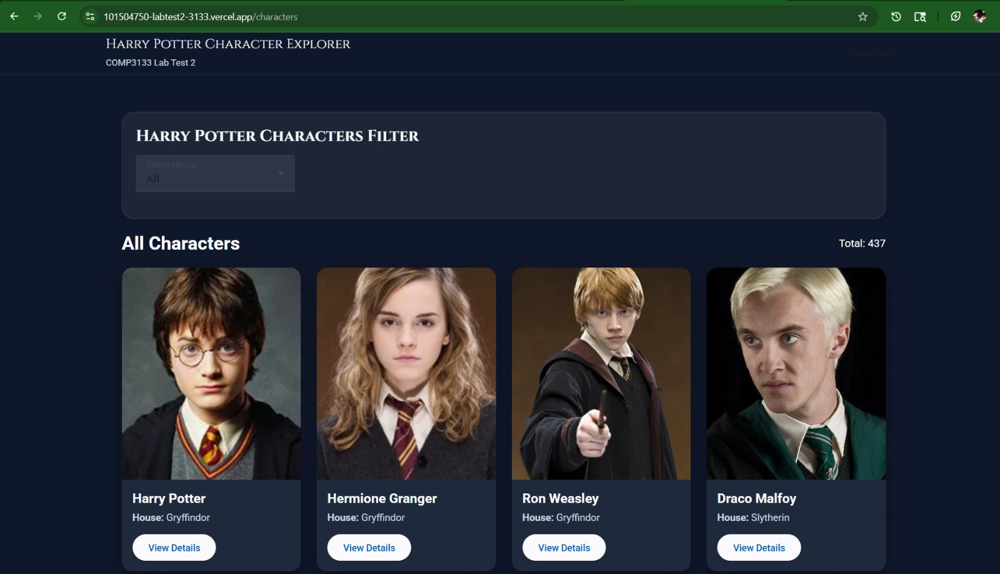
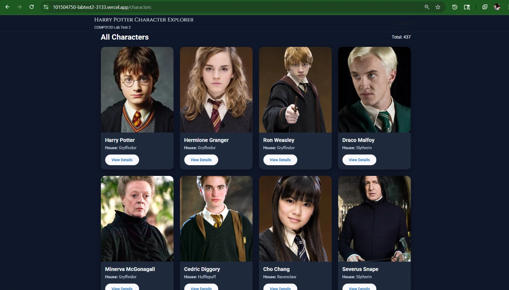
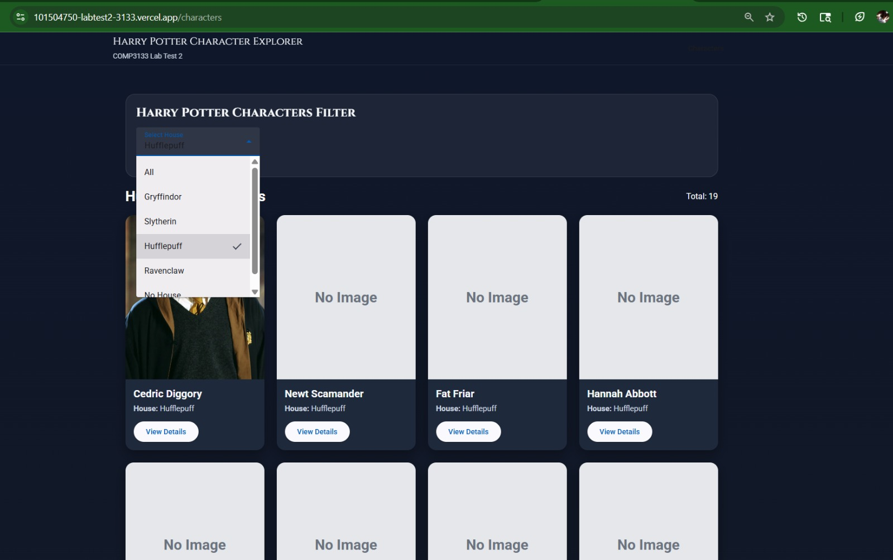
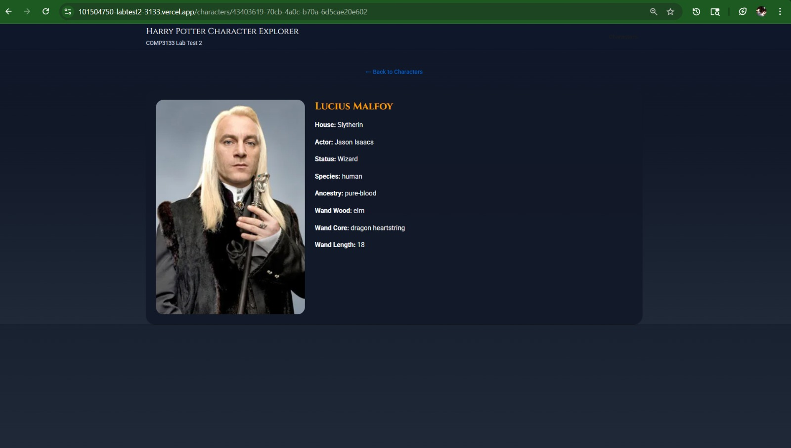

# 101504750_labtest2_3133

## COMP3133 Lab Test 2 – Harry Potter Character Explorer

This Angular application fetches and displays Harry Potter character data using a public API.

---

## 🌐 Live Application
https://101504750-labtest2-3133.vercel.app

---

## 📦 GitHub Repository
https://github.com/vvkvoda/101504750_labtest2_3133.git

---

## 🚀 Features

- Display all Harry Potter characters
- Filter characters by house (Gryffindor, Slytherin, etc.)
- View detailed character information
- Handle missing images with placeholder
- Handle missing wand data with proper fallback
- Responsive UI using Angular Material

---

## 🛠️ Technologies Used

- Angular (latest)
- Angular HttpClient
- Angular Material
- TypeScript
- Signals and Angular control flow (`@for`, `@if`, `@switch`)

---

## 📸 Screenshots

### Running Application


### Character List


### Filter by House


### Character Details


---

## ⚙️ How to Run Locally

```bash
npm install
ng serve